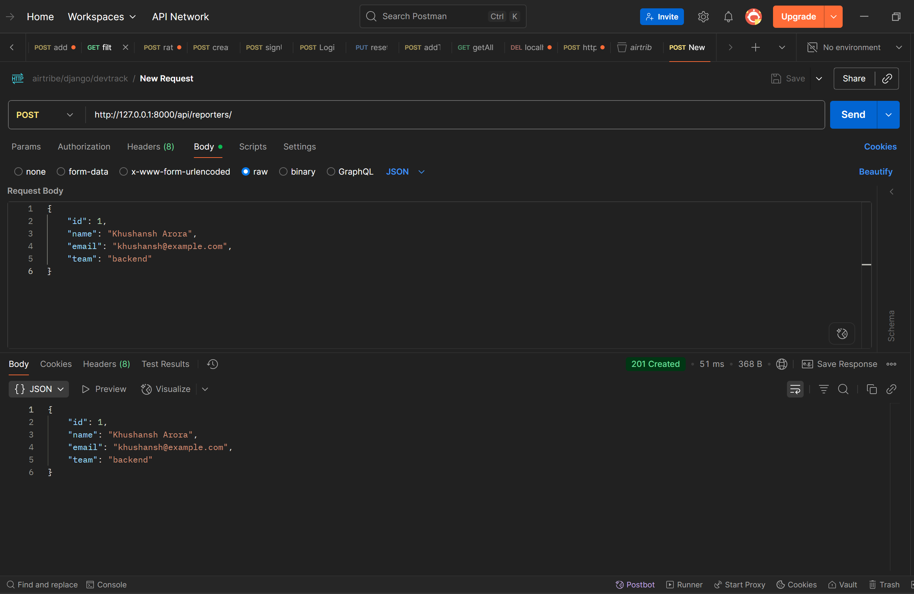
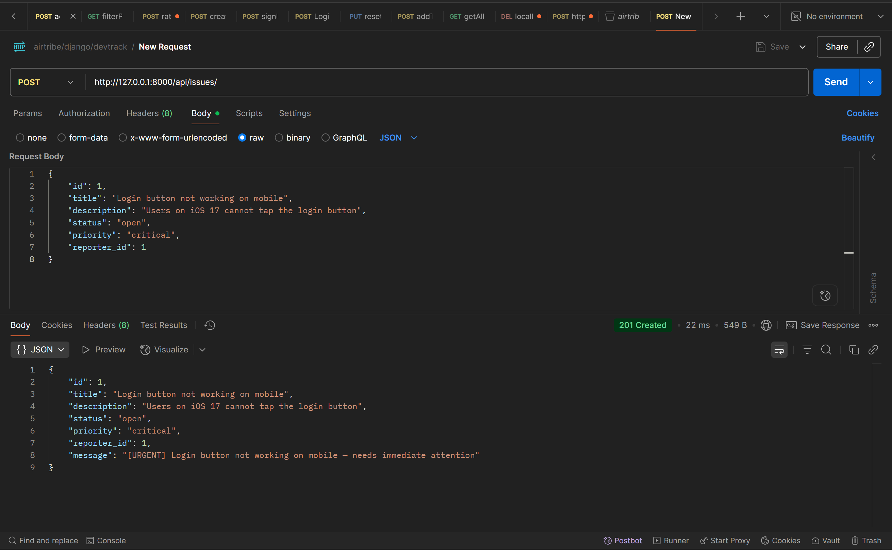
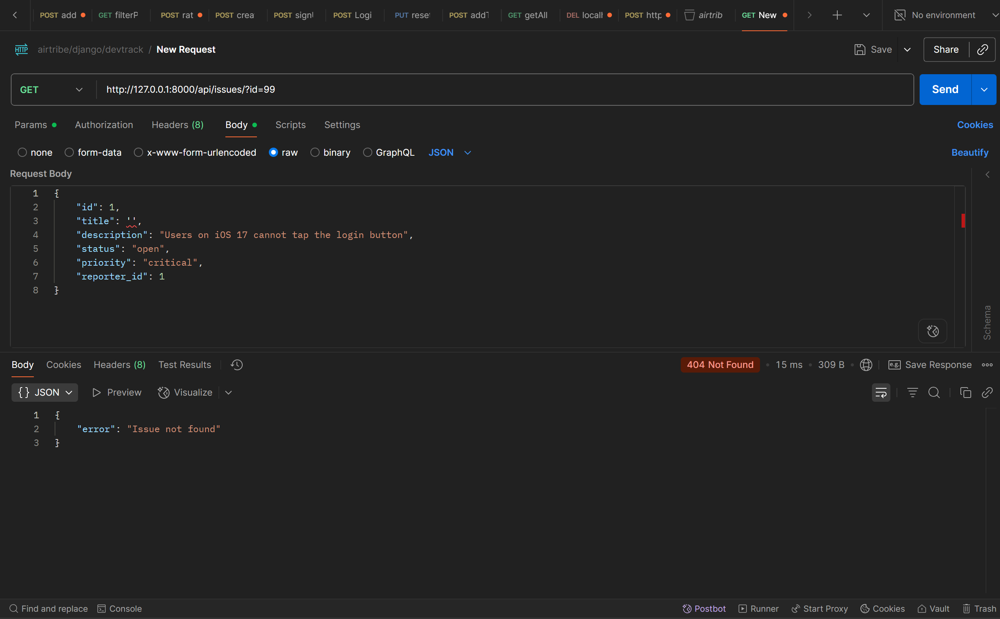
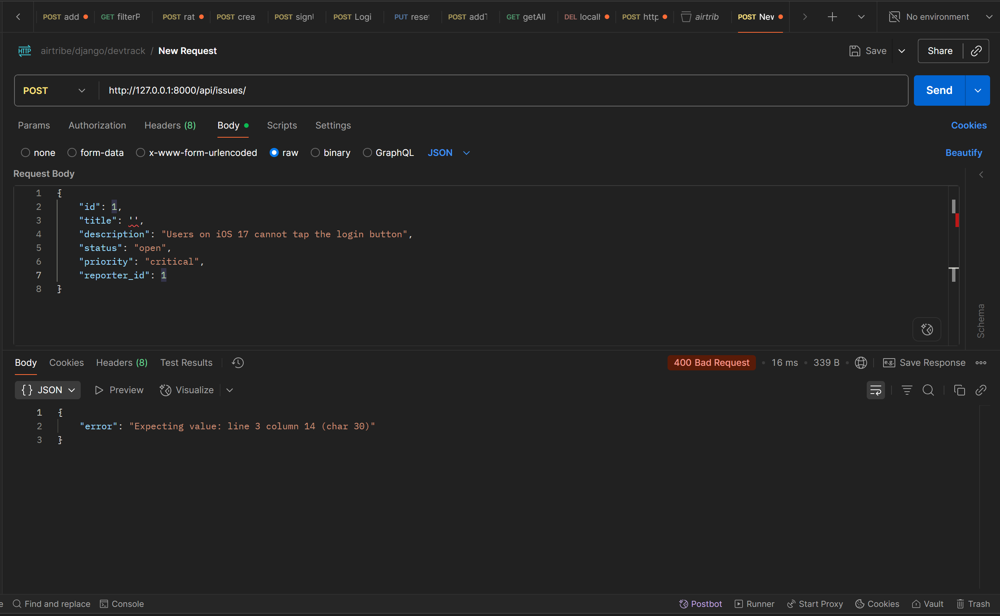

# DevTrack — Engineering Issue Tracker

A minimal backend API for tracking engineering bugs and issues. Built with Django, using JSON files for storage and OOP principles throughout.

---

## How to Run

**Requirements:** Python 3.11+, [uv](https://github.com/astral-sh/uv)

```bash
# 1. Clone the repository
git clone https://github.com/khushansh027/DevTrack-Django-API
cd devtrack

# 2. Install dependencies
uv sync

# 3. Start the server
uv run python manage.py runserver
```

Server runs at `http://127.0.0.1:8000/`

---

## Endpoints

### Reporter Endpoints

| Method | URL | Description |
|--------|-----|-------------|
| POST | `/api/reporters/` | Create a new reporter |
| GET | `/api/reporters/` | Get all reporters |
| GET | `/api/reporters/?id=1` | Get a single reporter by ID |

### Issue Endpoints

| Method | URL | Description |
|--------|-----|-------------|
| POST | `/api/issues/` | Create a new issue |
| GET | `/api/issues/` | Get all issues |
| GET | `/api/issues/?id=1` | Get a single issue by ID |
| GET | `/api/issues/?status=open` | Get all issues filtered by status |

---

## Sample Requests

### POST `/api/reporters/`
```json
{
    "id": 1,
    "name": "Khushansh Arora",
    "email": "khushansh@example.com",
    "team": "backend"
}
```

### POST `/api/issues/`
```json
{
    "id": 1,
    "title": "Login button not working on mobile",
    "description": "Users on iOS 17 cannot tap the login button",
    "status": "open",
    "priority": "critical",
    "reporter_id": 1
}
```

---

## Postman Screenshots

### Success — POST `/api/reporters/` (201 Created)


### Success — POST `/api/issues/` with critical priority (201 Created)


### Failure — GET `/api/issues/?id=99` (404 Not Found)


### Failure — POST `/api/issues/` with empty title (400 Bad Request)


---

## Design Decision

**JSON files over a database:** Since this is a learning project focused on OOP and Django routing, SQLite or PostgreSQL would add setup overhead without adding learning value. Using `issues.json` and `reporters.json` keeps the data layer simple and readable — you can open the files and see exactly what got saved after every API call. The tradeoff is no querying, no relations enforcement, and no concurrency safety, which would all matter in production.

---

## Project Structure

```
devtrack/
├── manage.py
├── pyproject.toml
├── issues.json
├── reporters.json
├── devtrack/
│   ├── settings.py
│   └── urls.py
└── issues/
    ├── models.py       # OOP classes: BaseEntity, Reporter, Issue and subclasses
    ├── views.py        # API logic for all 6 endpoints
    └── urls.py         # URL routing for the issues app
```